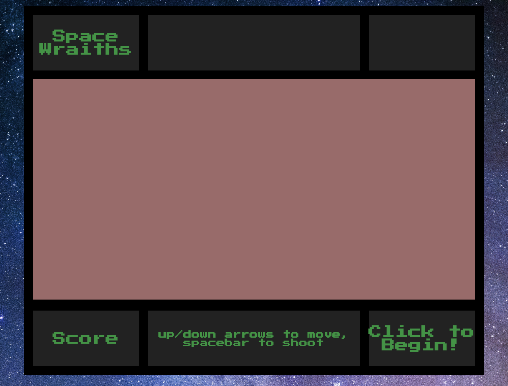
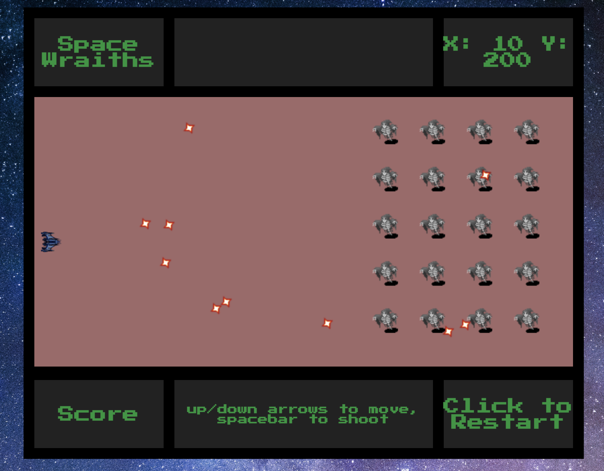
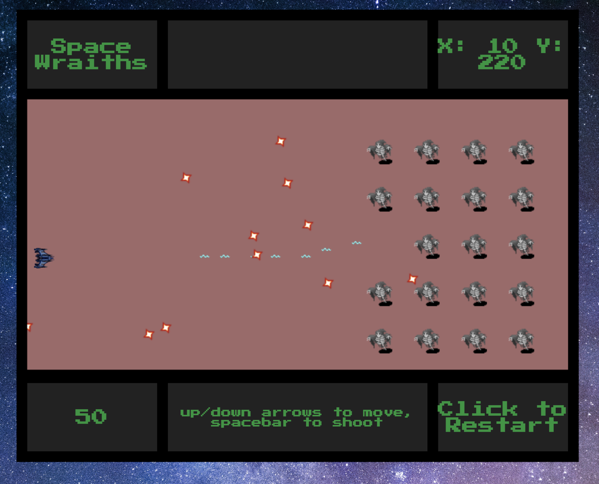

# Space Wraiths

This is a reimagining of Space Invaders, turned on its side. You pilot a ship up and down, trying to kill off all the space wraiths, while they do their best to blast you to smithereens. Their gameplay changes the fewer of them there are, so be careful out there!

[TODO:] deployed link will go here.

# HOW TO PLAY

## Goal:

Oh no, the space wraiths are back!!! You must destroy them all in order to survive, but be careful of their nefarious ways. You know the old saying, there's nothing more crafty than a desperate space wraith...

## Navigation:

Move your ship up and down with the up and down arrows. Fire your blaster by pushing the space bar.

## Start and Restart:

Click in the lower right-hand corner of the screen ("Click to Begin!") to load the game and start playing. The text changes to "Click to Restart" during gameplay and after the game ends. Click to wipe the screen and click again to begin anew!

## Wraith Behavior

Once there are 15 or fewer space wraiths remaining, they start moving faster. When there are 10 or fewer, they begin to come towards you, and their flight path depends on which are remaining.

[TODO: DID I CHANGE BEHAVIOR?]

## How to Lose

You lose if you're blasted to smithereens, if you're touched by a wraith, or if a wraith gets past you. Don't worry, the wraiths will post a message in the top center of screen, announcing to the galaxy how you perished.

## Screenshots:





# HOW TO INSTALL

1. Go to the repo [TODO: LINK HERE]
2. _`Fork`_ and _`Clone`_ the repo to your local machine

git clone https://github.com/davemolk/Dave-Project1.git

3. Open `index.html` in your browser to play

# HOW IT WORKS

The game uses canvas to render the images. The actions of the player are tracked with event listeners, whereas the wraiths controlled by a combination of fixed behaviors and randomization.

Excerpt 1:
This function controls the movement of the wraiths. The entire array of wraiths will change direction once one of them crosses either 340px or 10px on the y-axis (the height of the canvas is 400px). The function checks the number of remaining wraiths via the length of the array and updates the behavior if the number remaining is first 15 or smaller and next 10 or smaller.

```javascript
function wraithMovement() {
  arrWraith.map((wraith) => {
    if (wraith.y >= 340) {
      if (arrWraith.length <= 10) {
        arrWraith.map((wraith) => {
          wraith.speed = -10;
          wraith.y -= 1;
          wraith.x -= 25;
        });
      } else if (arrWraith.length <= 15) {
        arrWraith.map((wraith) => (wraith.speed = -5));
      } else arrWraith.map((wraith) => (wraith.speed = -2));
    } else if (wraith.y <= 10) {
      if (arrWraith.length <= 10) {
        arrWraith.map((wraith) => {
          wraith.speed = 10;
          wraith.y += 1;
          wraith.x -= 25;
        });
      } else if (arrWraith.length <= 15) {
        arrWraith.map((wraith) => (wraith.speed = 5));
      } else arrWraith.map((wraith) => (wraith.speed = 2));
    }
  });
}
```

Excerpt 2:
This function controls the wraith ray. It works by selecting a random wraith and then generating a random number that has to be hire than the blastFest variable in order for the wraith to fire. As the number of wraiths in the wraith array decreases, the threshold to fire also decreases, filling the screen with more wraith rays.

```javascript
function wraithRay() {
  let blastFest = 0.95;
  let randomWraith = Math.floor(Math.random() * 20);
  if (arrWraith.length <= 12 && arrWraith.length > 8) blastFest = 0.85;
  if (arrWraith.length <= 8) blastFest = 0.75;
  if (arrWraith.length <= 4) blastFest = 0.6;
  if (arrWraith.length <= 2) blastFest = 0.2;
  if (arrWraith[randomWraith] !== undefined) {
    if (Math.random() > blastFest) arrWraith[randomWraith].fire();
  }
}
```

# FUTURE CONSIDERATIONS

1. different obstacles?
2. background music?
3. sound effects (gun, explosion)?
4. "floating" when push arrow keys? or space by space?
5. change ship size once you reach a certain score?
6. animate explosions?
7. turbo boost for ship (change the amount of area covered by keystroke, need to toggle on and off)

## Acknowledgements

Thanks to Open Game Art for the ship image (https://opengameart.org/content/space-ship-construction-kit) and the dungeon images (https://opengameart.org/content/dungeon-crawl-32x32-tiles)
